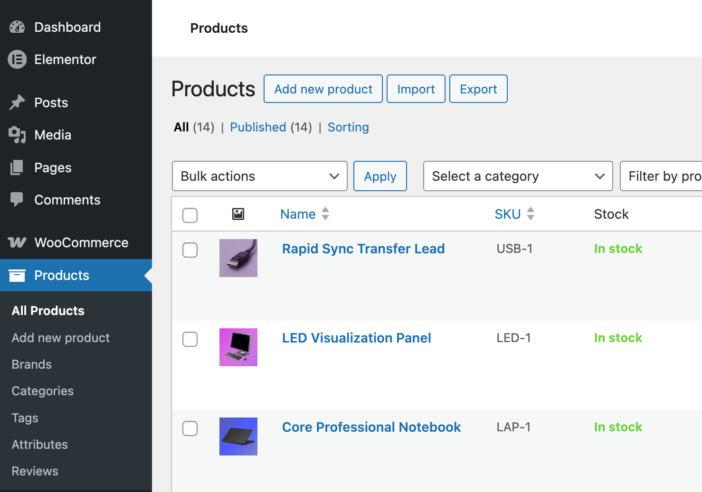

# WooCommerce Store Configuration Guide

This repository documents my process for setting up a complete WooCommerce e-commerce system for business clients.

The goal is to prepare a store that can accept payments, manage inventory, and process customer orders securely.

## 1. Store Initialization

- Install WooCommerce plugin
- Configure store location and currency
- Set measurement units
- Configure business information

## 2. Product Catalog Setup

- Create product categories
- Configure product attributes (size, color, variations)
- Upload product images
- Configure product descriptions
- Manage stock quantities

This allows businesses to manage inventory and product listings.

## 3. Payment Gateway Integration

I configure secure payment systems including:

- Paystack / Stripe / PayPal
- Checkout configuration
- Currency compatibility
- Order confirmation emails

Purpose:
Allow customers to pay online securely.

## 4. Shipping & Tax Configuration

- Create shipping zones
- Flat rate and calculated shipping
- Local pickup options
- Tax rules (if required)

This allows automated order pricing.

## 5. Customer Account System

- Customer registration
- Password security
- Order history
- Email notifications

Customers can track orders and manage accounts.

## 6. Security & Backup

- Secure checkout (HTTPS)
- Anti-spam protection
- Scheduled backups
- Role management

Protects payment and personal data.

## 7. Order Processing Workflow

- Order received
- Payment verification
- Status updates
- Invoice email
- Order completion

I also train the business owner on how to manage orders.

## Final Testing

Before launch I:

- test checkout
- test payment
- test email notifications
- test mobile experience

The store is then ready for customers.

---

## Store Implementation Evidence

Below are screenshots from real WooCommerce environments I configured and deployed for business websites.

### WooCommerce Dashboard
This shows store initialization, order tracking and store configuration.

### Product Catalog Management
I created product listings, categories and inventory.

### Product Editing Interface
I configured product descriptions, pricing, stock and images.

### Payment Gateway Configuration
I integrated online payment systems for customer checkout.

### Shipping Configuration
Shipping zones and delivery pricing were configured for customer orders.

### Shopping Cart
Customers can review and manage their items before checkout.

### Checkout System
Secure checkout page used for order processing and payment.

